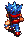
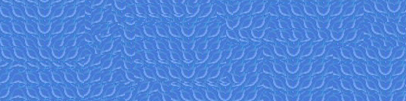

# Game Design Document: Treasure Hunters!

##Moving Objects:
_(All moving objects aside from Arrows will have 2 or 3 step animations along with movement)_

  1. Treasure Hunter (player)
    - Movement: Horizontal and vertical on arrow key presses 
    - Generation: Bottom of the screen in the same place every time the user loses a life or enters a temple
    - Sprites:
    - 
    - 
    - 
    - 
    - 
    - Credit: http://spritedatabase.net/files/snes/571/Sprite/Red.png 
  1. Cars/Logs/Crocodiles 
    - Movement: Horizontal one way, direction depending on row generated
    - Generation: Randomly at the left or right edge depending on row. All cars/logs/alligators in the same row will move the same direction at the same speed.
    - Sprites:
    -  
    -  
    - 
    - 
    - Credit: http://spritedatabase.net/files/neogeo/836/Sprite/MSCar2.gif 
    - 
    - Credit: http://www.swish-designs.co.uk/blog/?p=1331 
    - 
    - 
    - 
    - 
    - Credit: http://zeldapower.com/images/others/foe/sprites/Crocodile_snapping1.gif http://zeldapower.com/images/others/foe/sprites/Crocodile_swimming.gif 
  1. Holy Grail
    - Movement: Random horizontal and vertical at the same time, changes with timer. Moving randomly around the screen
    - Generation: Random off-screen and then moves onscreen
    - Note: Gives player extra life
    - Sprite:
    - 
    - Credit:  http://officialpetsociety.files.wordpress.com/2011/09/medieval-goblet.png 
  1. Guardians
    - Movement: Horizontal back and forth in their set boundaries (1-3 Guardians, covers whole horizontal boundary)
    - Generation: Random within their set boundaries at the beginning of a level/life
    - Note: Shoot Arrows vertically down the screen at random intervals within a set time range
    - Sprite:
    - 
    - 
    - 
    - 
    - Credit: http://spritedatabase.net/file/9197 
  1. Arrows 
    - Movement: Vertically down the screen at constant speed
    - Generation: On random intervals within a set time frame always at the location of the shooting Guardian
    - Sprite:
    - 
    - Credit: http://spritedatabase.net/file/9197
  1. Temples 
    - Movement: None
    - Generation: Always at the same places on the top of the screen
    - Note: 5 temples are the end goals for the treasure hunter
    - Sprite: 
    - 
    - 
    - Credit: http://images.wikia.com/kirby/en/images/d/d2/KEY_Pyramid_sprite.png
    - Also Credit: http://spritedatabase.net/files/snes/571/Sprite/Red.png
  1. River 
    - Movement: None, just rushing water animation
    - Generation: Always in the same place
    - Note: Used for object detection of falling off of a log
    - Sprite:
    - 
    - 
    - 
    - Credit: http://img393.imageshack.us/img393/730/water6cx.png 
 
##Basic Functionality

_Some parts of this section will be repeated in the more segmented outline below_

  - Player moves the treasure hunter with the arrow keys: up, down, left, and right
  - Trying to get treasure hunter into temple. 
    - Once a treasure hunter has entered a temple, a new treasure hunter cannot enter the same temple.
    - Total of 5 temples, once 3 have been entered, all are cleared.
  - To get to temple, must first dodge cars along a desert path; then must jump across logs to get to temple. 
    - All the while, the Guardians will be shooting Arrows.
    - If the player steps on a gator, then the player loses a life.
    - If the player gets hit by a car, then the player loses a life.
    - Losing a life will change the player sprite to a skull and crossbones, and then reset the player back to the start.
  - Player will start with three lives.
    - Holy Grails will appear randomly with a small chance throughout the game and if the user hits one then he/she will be given another life.
  - Game will have a timer, if the player does not make it to the temple within a certain time, a boulder will roll across the screen and kill the treasure hunter, causing the player to lose a life.
    - Timer will be the same for all levels.
  - When the player gets to a temple, he/she will earn points equal to the amount of time left times a difficulty factor.
    - Difficulty factor will start at 1.25 and be squared for every difficulty level. (1.25, 1.5625, 2.44140625, 5.96046448, 35.5271368, etc.)
    - Difficulty factor will increase with each level.
  - Each level will be getting the treasure hunter into an unoccupied temple 3 times. During all three times the speed of all objects will be the same.
    - When a level is completed, the user moves on to the next level, where everything moves faster.
    - This continues indefinitely until the user loses.
    - The user’s movement speed will also increase, but the limiting factor is the user’s reaction time. Thus after a certain point it will be impossible to beat the level.

##Object Detection:

  - For the player to be securely on a log, road, or temple, at least half of the player’s sprite must be on the log, road, or temple (as opposed to being on the river).
  - For the player to be hit by a Holy Grail, car, or Arrow, any overlap of the player’s sprite with the respective Holy Grail, car, or Arrow’s sprite will result in a collision.
  - For crocodiles, the player’s sprite must have at least 1/3 of overlap for a collision to be detected.

##Controls

  - The player will control the treasure hunter by pressing down the arrow keys (up for up, down for down, etc.). 
  - While a key is pressed down, the user will move in that direction. 
  - All movement animation will be the same, regardles of direction of motion.
  
##Score

  - When the player gets to a temple, he/she will earn points equal to the amount of time left times a difficulty factor.
    - Difficulty factor will start at 1.25 and be squared for every difficulty level. (1.25, 1.5625, 2.44140625, 5.96046448, 35.5271368, etc.)
    - Difficulty factor will increase with each level.
  - Score cannot decrease.
    
##Lives

  - Player will start with three lives.
    - Holy Grails will appear randomly with a small chance throughout the game and if the user hits one then he/she will be given another life.
    - Lives will be lost when hit by a car, arrow, or crocodile or when the player falls into the river.
    - Also, a life will be lost if the user cannot make it to a temple within the alloted time.
  - Lives will be a member variable of the window as a new treasure hunter object will be made for each time the treasure hunter spawns at the bottom of the screen.

##Game Layout

###Title Screen

  - Credits (Desert): http://spritedatabase.net/files/gameboy/732/Background/SK_ScorchingDesert.png 
  
  - In this screen, the basic background of the window is the desert gif file while there is a text box with directions in front.
  - The only interactive button on this screen is the "Begin!" button, which will start the game by deleting the welcome text box and populating the screen with the player, temples, river, and guardians.
    - It will also start the timer (Potential countdown to prepare the user) to generate logs, crocodiles, and holy grails.
    - Game will start on button click and user will be allowed to move (after countdown if implemented).
  
###Game Screen

  - In this screen, the game timer will run and all functionality will be used. Arrow keys will move the user's character and cars, logs, gators, holy grails, guardians, and arrows will all move based on the timer.
  - Each level will have a faster timer and thus faster moving objects until it becomes impossible.
  - When the player dies or reaches a temple, the character will respawn at the bottom and the time (in the corner) will reset to its starting value.
    - Appropiate score or life deduction will be done.
    - Potential to add a countdown timer to reset the level and disable movement until the timer hits 0.
  - As cars, logs, and alligators pass through the edges of the screen, they will delete themselves to free up memory.
    - New cars, logs, and alligators will randomly spawn at designated points and slide into view.
  - Text boxes with labels and appropiate values will show the time, score, and remaining lives at the top of the screen.
  - Pressing "P" will pause the game and send the game to the pause screen.

###Pause Screen

  - This screen will just stop the timer and add a text box with controls and a notification that the game is paused.
  - The only button will be to resume the game (optional countdown timer to allow the user to prepare).
    - This button will restart the timer and cause the game to continue.

